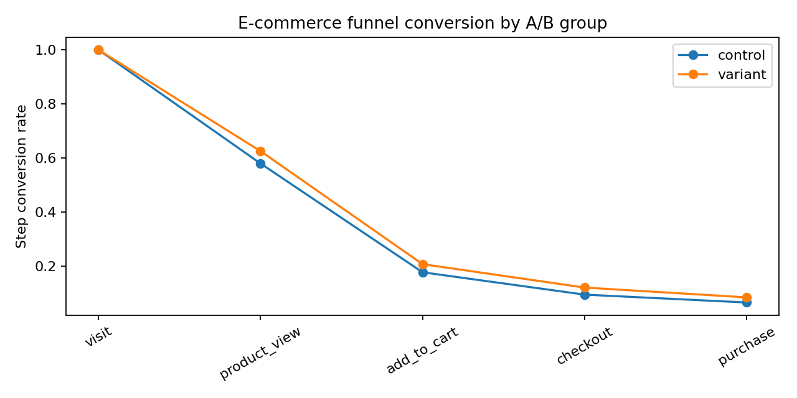

# E-commerce Funnel Analytics & A/B Test

    **Role:** Product Analyst / Growth Analyst  
    **Dataset:** Synthetic / anonymized demo data created for portfolio use.  
    **Stack:** Python, pandas, scipy, matplotlib, funnel analysis, A/B testing

    ## Business problem

    A product team needs to understand where users drop off in the purchase funnel and whether a checkout/product-page variant improves final purchase conversion.

    ## What was built

    Built a funnel analytics project with visit → product view → add to cart → checkout → purchase conversion rates, source segmentation, A/B conversion comparison, uplift calculation and statistical significance test.

    ## Key outputs

    - `results/funnel_summary.csv` — funnel metrics by A/B group
- `results/ab_test_result.csv` — conversion, uplift, z-score and p-value
- `results/funnel_conversion_by_group.png` — visual funnel comparison

    ## How to run

    ```bash
    python -m venv .venv
    source .venv/bin/activate  # Windows: .venv\Scripts\activate
    pip install -r requirements.txt
    python src/main.py
    ```

    ## Resume-ready bullets

    - Analyzed e-commerce funnel conversion and drop-off across key steps from visit to purchase.
- Evaluated A/B test impact on purchase conversion using uplift, two-proportion z-test and business recommendation.

   ## Business recommendation

The treatment group improved final purchase conversion by X pp.
If p-value < 0.05, the variant can be considered statistically significant.
If p-value >= 0.05, keep the test running or increase sample size.


